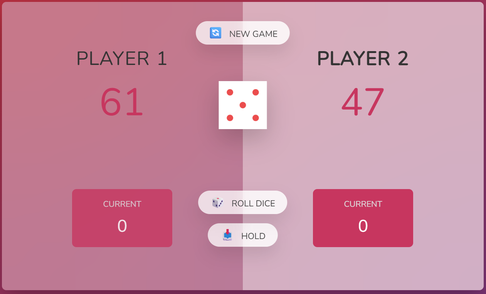

# 🎲 Dice Game – HTML5, CSS & JavaScript
This is a simple turn-based dice game built with HTML5, CSS, and vanilla JavaScript. The objective is to be the first player to reach 100 points!

## 📷 Preview 

## 🔗 Play the Game
link: https://afonsomassunari.github.io/DiceGame/

## 🚀 How to Play
Two players take turns.

On each turn, a player can roll the dice as many times as they wish.

Each roll adds its value to the current round score.

The player can choose to:

## ✅ Hold: Save the current round score to their total score and pass the turn to the other player.

## 🎲 Roll again: Take the risk to gain more round points.

## ❌ If a 1 is rolled: The player loses all round points and the turn immediately passes to the other player.

## 🏆 Objective
The first player to reach 100 total points wins the game!

## 📦 Technologies Used
HTML5 – game structure

CSS3 – visual style and layout

JavaScript (Vanilla) – game logic, turn handling, and events

